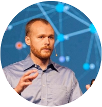
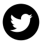

class: center, middle

# Introduction to DevOps

### Sid Palas -- DevOps Directive!!!



&nbsp;&nbsp;&nbsp;&nbsp;[](https://devopsdirective.com)&nbsp;&nbsp;&nbsp;&nbsp;
&nbsp;&nbsp;&nbsp;&nbsp;[](https://youtube.com/c/DevOpsDirective)&nbsp;&nbsp;&nbsp;&nbsp;
&nbsp;&nbsp;&nbsp;&nbsp;[](https://twitter.com/sidpalas)&nbsp;&nbsp;&nbsp;&nbsp;

---

class: middle, center

<iframe allowfullscreen frameborder="0" style="width:740px; height:580px" src="http://10.0.0.37:8080"></iframe></div>

---

class: middle, center

###"DevOps is the combination of cultural philosophies, practices, 

###and tools that increases an organization’s ability to deliver 

###applications and services at high velocity"

&nbsp;


---

# Agenda

- Build and deploy this presentation... 

---

# Agenda

- Build and deploy this presentation... 

- This presentation was created with markdown + remark.js

```html
<!DOCTYPE html>
<html>
  <head>
    <title>Intro to DevOps</title>
    <meta charset="utf-8">
    <link rel="stylesheet" href="stlyes.css">
  </head>
  <body>
    <script src="https://remarkjs.com/downloads/remark-latest.min.js">
    </script>
    <script>
      var slideshow = remark.create({
        sourceUrl: 'index.md'
      });
    </script>
  </body>
</html>
```

---

# Agenda

- Build and deploy this presentation... 

- This presentation was created with markdown + remark.js
  
#### Part 1:
```md
  1. Start with .md file
  2. Pull in js dependencies
  3. Serve locally
```

#### Part 2:
```md
  1. Dockerize with Caddy
  2. Provision VM on Digital Ocean
  3. Deploy to codechef.devopsdirective.com
```

#### Part 3 (Time Permitting):
```md
  1. Set up CI/CD with GitHub Actions
```

---

class: middle

```md
# TODO:

1.  Get html template 
2.  Clean up boilerplate
3.  Serve with python
4.  Create local Dockerfile
5.  Create local Caddyfile
6.  Create Makefile
7.  Build image
8.  Run container

9.  Provision Digital Ocean VM
10. Attach Firewall
11. Add DNS record
12. Create Docker Hub repo
13. Create production Dockerfile
14. Create production Caddyfile
15. Build production image
16. Push production image
17. SSH onto VM
18. Run container
19. Upgrade SSL to full

20. Create github action
21. Setup SSH key
22. Setup Docker Hub
23. Checkout code
24. Build and Push
25. Create deploy make target
26. Add deploy to workflow
```
---

class: center, middle

# Questions?
